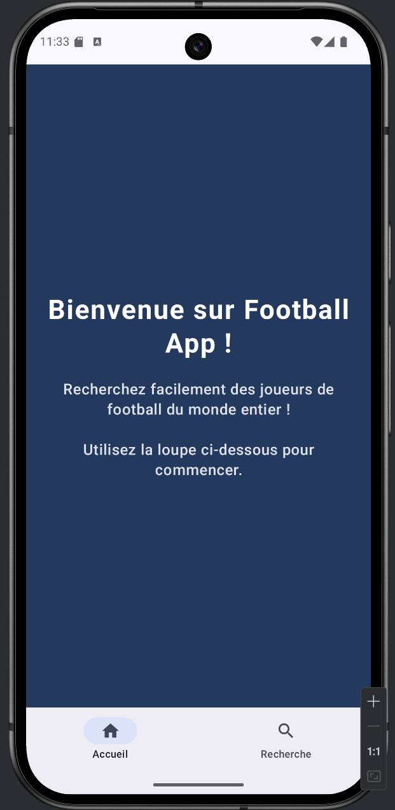
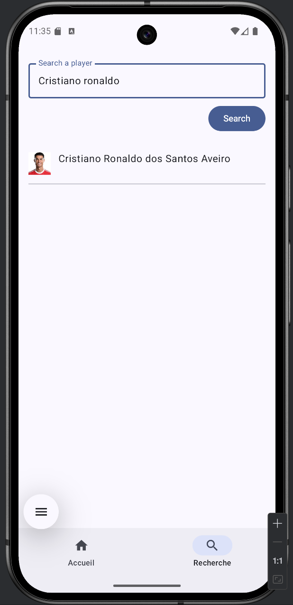
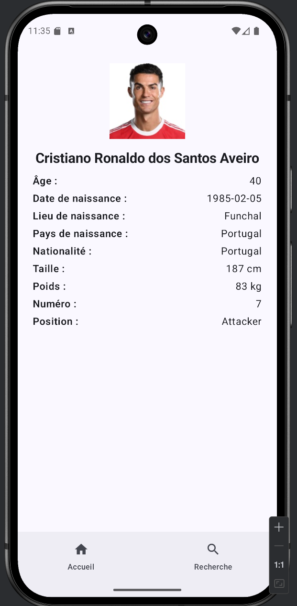

# ⚽ Football App – Recherche de joueurs de foot

## Présentation

Football App est une application Android développée en Kotlin avec Jetpack Compose.  
Elle permet de :
- Rechercher des joueurs de football du monde entier via l’API [API-FOOTBALL](https://www.api-football.com/documentation-v3)
- Consulter le profil détaillé d’un joueur (nom, prénom, club, âge, nationalité, photo…)
- Profiter d’une interface internationale (FR / EN) : la langue de l’application s’adapte à la langue du téléphone

---

Voici la page d’accueil :


Page de recherche :


Détail d’un joueur :


---

## Fonctionnalités principales

- **Page d’accueil** : présentation de l’app (en français ou anglais)
- **Barre de recherche** : recherchez un joueur par nom ou prénom (ex : “cristiano ronaldo”, “mbappé”, “neymar”)
- **Affichage des résultats** : liste des joueurs correspondants, avec nom, club et photo
- **Page profil joueur** : toutes les infos détaillées (prénom, nom, âge, date de naissance, lieu, nationalité, taille, poids, numéro, poste, photo)
- **Navigation fluide** via une barre en bas d’écran (Accueil / Recherche)
- **Gestion des erreurs** : messages clairs si la recherche est vide ou invalide, ou si aucun joueur n’est trouvé

---

## Prérequis et installation

1. **Cloner le dépôt**
    ```bash
    git clone https://github.com/Dendeey/android-football-app.git
    ```

2. **Ouvrir dans Android Studio**  
   *(Menu : “Open an existing project”)*

3. **Lancer l’application sur un émulateur ou un téléphone Android**

    - Cliquer sur “Run” dans Android Studio
    - Choisir un émulateur ou brancher un téléphone en USB

---

## Exemples d’utilisation

- **Rechercher un joueur**
    1. Aller sur la page “Recherche” (icône loupe en bas)
    2. Entrer le nom :
        - `cristiano ronaldo`
        - `mbappe`
        - `griezmann`
        - `neymar`
        - `messi`
    3. Cliquer sur le bouton “Rechercher” / “Search”

- **Afficher un profil joueur**
    - Cliquer sur un joueur dans la liste pour voir sa fiche détaillée

---

## Internationalisation

- L’application détecte automatiquement la langue du système
- Les textes sont affichés en français ou en anglais selon la langue du téléphone
- Pour tester : changer la langue de l’émulateur ou du téléphone (Paramètres > Système > Langue)

---

## Astuces et limites

- **La recherche nécessite au moins 3 caractères**
- Certains joueurs peuvent avoir peu d’informations selon l’API
- Si aucun résultat : essayez un autre nom, ou vérifiez la clé API

---

## Dépendances principales

- Jetpack Compose
- Retrofit / OkHttp
- Material 3

---

## FAQ

**Q : Je n’ai pas de résultat à la recherche**  
R : Vérifiez que vous avez bien une clé API valide et que vous tapez au moins 3 lettres.

**Q : Comment changer la langue de l’app ?**  
R : Changez la langue du téléphone, l’application suivra automatiquement.

---

## Auteurs

Projet réalisé par **[David SIM]**  
Dans le cadre de mon [Bachelor 3 Developpement informatique] chez [Sup de Vinci].

---
